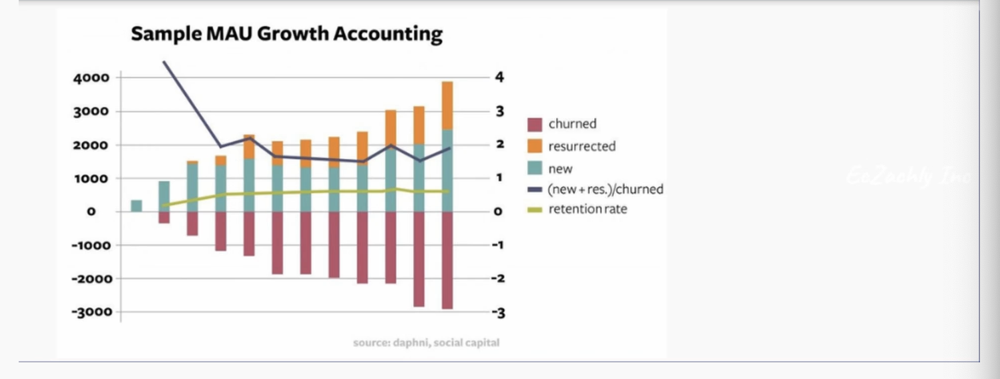
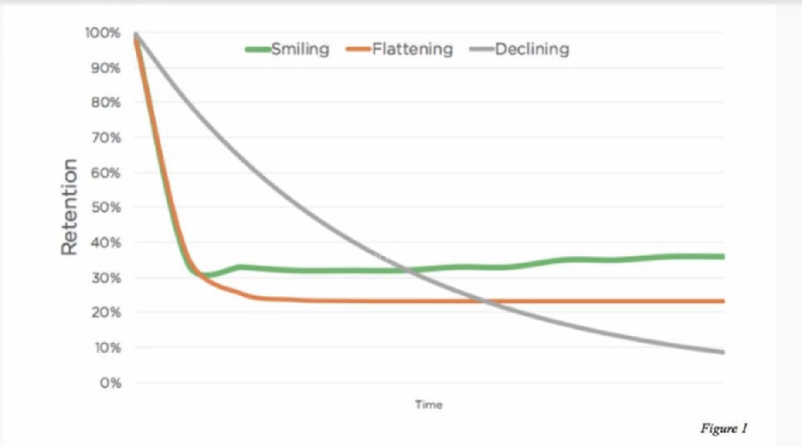

<details>
<summary> Links </summary>

1. [Medium Article](https://medium.com/@karkisatkarhere/from-patterns-to-practice-50978850fa5f)
2. [Jade Codes](https://www.youtube.com/watch?v=biaaA9GfNPw)

    
</details>


<details>
<summary> Analytical Pattern bootcamp notes</summary>

1. Growth Accounting
    - How FB tracks inflow and outflow of active and inactive users (any state change tracking) 
2. Survival Analysis 
    - Of all users that signed up today, what % are still active in 30 days, 60 days, 90 days (Retention Number)

<details>
<summary> 7 patterns </summary>

<details>
<summary> 1. Aggregation-based patterns  </summary>

- The most common type of analysis
- You will mostly use `Group BY` with `Sum, AVG, percentile, count, may be array_agg`  
1.  Trend Analysis also give you RCA 
    - wow(week on week) change of dimension shows +1million but it should also give you that +1.5mil in US but -0.5 mil in India, shows it can be different overall. Bring in different dimensions like gender, country.
2. Root Cause Analysis (WHY)
    - line chart we have a dip and the reason for the dip is e.g. of spike during chinese new year for the airline. 
3. Composition 
    - e.g., user distribution by region, we have these many users in US, China.
4. Always have upstream data aggregated at daily level, that is aggregated along user_id 
    - Good for experimentation - group users and then easily add dimension to the metrics
5. IMP - when doing agg, you shouldn't be going back to fact data because fact data should be aggregated along the dimension like user_id, device_id. Dimensions will not be 1:1 
    - A key takeaway is to aggregate data at a daily level along a primary dimension (like user ID) for efficiency and to support experimentation (A/B testing). 
 6. However, caution is advised against including too many dimensions, as it can lead to overly granular data that loses analytical value.

#### Gotchas 
1. Careful about what all dimensions you bring in aggregation - will get you back to daily data 
2. Be mindful of grain you are working with, gender is cool only two-three, country only one person follows me if he leaves 100% drop so lookout at numbers as well when dealing with % based metrics.
3. Long time frame analysis (>90 days) - try to lower the cardinality - look at per week or year may be not per day, to avoid lot of rows. Daily grain is too much cardinality - say you have 90 days and 200 countries = 1800 rows - if you have any high cardinality dimension then it will increase.


### Lab 
- Defining states (new, retained, churned, resurrected, stale) via CASE WHEN statements with date logic (e.g., new if yesterday is null and today is active; retained if last active date is yesterday). Weekly states consider a 7-day window.

``` sql 
CREATE TABLE users_growth_accounting (
     user_id TEXT,
     first_active_date DATE,
     last_active_date DATE,
     daily_active_state TEXT,
     weekly_active_state TEXT,
     dates_active DATE[],
     date DATE,
     PRIMARY KEY (user_id, date)
 );

-- user can be weekly active but can be daily churned 
WITH yesterday AS (
    SELECT * FROM users_growth_accounting
    WHERE date = DATE('2023-03-10') -- starting from this date 
),
     today AS (
         SELECT
            CAST(user_id AS TEXT) as user_id,
            DATE_TRUNC('day', event_time::timestamp) as today_date,
            COUNT(1)
         FROM events
         WHERE DATE_TRUNC('day', event_time::timestamp) = DATE('2023-03-11')
         AND user_id IS NOT NULL
         GROUP BY user_id, DATE_TRUNC('day', event_time::timestamp)
     )

         SELECT COALESCE(t.user_id, y.user_id)                    as user_id,
                COALESCE(y.first_active_date, t.today_date)       AS first_active_date,
                COALESCE(t.today_date, y.last_active_date)        AS last_active_date,
                -- this is imp here
                CASE
                    WHEN y.user_id IS NULL THEN 'New'
                    WHEN y.last_active_date = t.today_date - Interval '1 day' THEN 'Retained'
                    WHEN y.last_active_date < t.today_date - Interval '1 day' THEN 'Resurrected'
                    WHEN t.today_date IS NULL AND y.last_active_date = y.date THEN 'Churned'
                    ELSE 'Stale'
                    END                                           as daily_active_state,
                -- retained vs resurrected, used bit array at facebook 
                CASE
                    WHEN y.user_id IS NULL THEN 'New'
                    WHEN y.last_active_date < t.today_date - Interval '7 day' THEN 'Resurrected'
                    WHEN
                            t.today_date IS NULL
                            AND y.last_active_date = y.date - interval '7 day' THEN 'Churned'
                    WHEN COALESCE(t.today_date, y.last_active_date) + INTERVAL '7 day' >= y.date THEN 'Retained'
                    ELSE 'Stale'
                    END                                           as weekly_active_state,
                -- from previous slides
                COALESCE(y.dates_active,
                         ARRAY []::DATE[])
                    || CASE
                           WHEN
                               t.user_id IS NOT NULL
                               THEN ARRAY [t.today_date]
                           ELSE ARRAY []::DATE[]
                    END                                           AS date_list,
                COALESCE(t.today_date, y.date + Interval '1 day') as date
         FROM today t
                  FULL OUTER JOIN yesterday y
                                  ON t.user_id = y.user_id

```
### Analysis 
- Extending to survivorship analysis by tracking a cohort (e.g., users first active on March 1, 2023), calculating percent active over time to form a J-curve (e.g., 100% on day 1, dropping to 2% long-term)
``` sql 
 SELECT
       date, 
       COUNT(CASE
           WHEN daily_active_state
                    IN ('Retained', 'Resurrected', 'New') THEN 1 END)  as number_active,
       COUNT(1) FROM users_growth_accounting
     where first_active_date = date('2023-01-10')
GROUP BY date;

-- giving you can idea many users are staying back 
-- you can another dimension for this like which day of the week 
SELECT
       date - first_active_date AS days_since_first_active,
       CAST(COUNT(CASE
           WHEN daily_active_state
                    IN ('Retained', 'Resurrected', 'New') THEN 1 END) AS REAL)/COUNT(1) as pct_active,
       COUNT(1) FROM users_growth_accounting
GROUP BY date - first_active_date; SELECT
       date, 
       COUNT(CASE
           WHEN daily_active_state
                    IN ('Retained', 'Resurrected', 'New') THEN 1 END)  as number_active,
       COUNT(1) FROM users_growth_accounting
     where first_active_date = date('2023-01-10')
GROUP BY date;

-- giving you can idea many users are staying back 
-- you can another dimension for this like which day of the week 
SELECT
       date - first_active_date AS days_since_first_active,
       CAST(COUNT(CASE
           WHEN daily_active_state
                    IN ('Retained', 'Resurrected', 'New') THEN 1 END) AS REAL)/COUNT(1) as pct_active,
       COUNT(1) FROM users_growth_accounting
GROUP BY date - first_active_date;
```

</details>

<details>
<summary> 2. Cumulation based patterns </summary>

- focussed on changes over time, between consecutive days (e.g., active today vs. yesterday)
- based on cumultaive table design
- FUll outer join (to account for missing data, where "no data is data.") here no data is data, we want to keep track of it. In aggregation we don't care about no data.

1. State Change Tracking
- opposite of SCD 
- instead of keeping all values of a dimension, it just keep the changed value, like a change log 

    - Growth Accounting 
        - New (didn't exist yest, active today)
        - Retained (active yest, active today)
        - Churned (active yest, inactive today)
        - Resurrected (active today, inactive yest)
        - Stale (inactive yes, inactive today)
        - deleted (don't exist today but were active/inactive yest) - sometimes you delete them sometimes just stale
    
    - Growth rate = (new +resurr) - churned
    
        

    - Also used for tracking fake accounts, new fake account, reclassified as fake account, declassified.
    - ML model at Netflix was labelling applications as risky and not risky, then monitored the flow of that as well for monitoring. 
    - At Airbnb, model for hosts classification - host cancels on you. labelling hosts as risky not risky, track the effectiveness of training hosts.
    - It’s particularly powerful for monitoring machine learning model health (e.g., sudden shifts in classifications post-update) and strategic goals (e.g., reducing risky hosts through education).

2. Survivorship analysis or Retention (J curves)
    - tracking how many users remain active over time from a cohort
    - Survivorship analysis measures retention from a reference date (like signup) over time, starting at 100% and declining as users drop off.
    - Successful apps show a flattening curve (some users stick around long-term), while a steep decline indicates poor stickiness.
    - beyond growth to areas like cancer patient survival (reference: diagnosis date, state: alive), smokers remaining smoke-free (reference: quit date, state: not smoking).
    - This bias warns against focusing only on visible successes (like content creators who “made it”) while ignoring unseen failures, which can skew analysis.
      
</details>

<details>
<summary> 3. Window Based patterns </summary>
    
- Calculations over a time window, split into two types:
 1. day-over-day, week-over-week, month-over-month, or year-over-year changes (like `derivatives`, showing rate of change) 
 2. `rolling sums or averages` (like integrals, showing cumulative trends).
    - SYNTAX 
    ```sql 
    SUM(column_name) OVER (
    [PARTITION BY dimension1, dimension2]
    ORDER BY order_column
    ROWS BETWEEN start_point AND end_point
    ) AS rolling_sum 
    ```
- syntax involving partitioning by dimensions like user ID and defining the window size (e.g., rolling 7 days). 
- A practical note is to partition data in big data environments to avoid performance issues, OOM issues.
- `Derivative metrics` make charts spikier, increasing volatility (especially day-over-day), while `rolling metrics` smooth noise, as seen in stock trading with 50-day or 200-day moving averages (e.g., golden cross for buy signals when 50-day crosses above 200-day)
- Airbnb example notes year-over-year metrics were skewed by the 2020 pandemic, leading to comparisons with 2019 instead.

</details>   <!--window based-->

<details>
<summary> 4. Enrichment Based patterns </summary>
We are already have all the columns we need to we will skip this one, we are assuming to be in the master layer.

</details> <!--Enrichment based-->

<details>
<summary>  2. Experimentation</summary>


</details> <!--Experimentation-->

<details>
<summary> 3. Prediction</summary>


</details> <!--Prediction-->

<details>
<summary> 4. Clustering</summary>


</details> <!--Clustering-->

<details>
<summary> 5. Decision Tree</summary>


</details> <!--Decision Tree-->

<details>
<summary> 6. Accumulation Derivative </summary>


</details> <!--Accumulation Derivative -->


<details>
<summary> 7. Funnel analysis </summary>

- Focuses on tracking user behavior through a series of steps or stages, often with the goal of optimizing conversions, engagement, or revenue.
- Funnels are essential for understanding user drop-off points and optimizing the user journey.
- The primary aim is to push users through these stages(from initial interaction to signing up or making a purchase) to achieve business goals such as increased revenue, growth, or engagement.

## LAB 
This involves tracking two key events: visiting the sign-up page (URL: /signup) and completing the sign-up process (URL: /api/v1/users). The goal is to calculate the percentage of users who complete the sign-up after visiting the page.

#### Cardinality reduction 
```sql
case when referrer like '%zachwilson%' then 'onsite'
     when  referrer like '%eczachly%' then 'onsite'
     when  referrer like '%linkedin%' then 'Linkedin'
     when  referrer like '%t.io%' then 'Twitter'
     ELSE 'Other'
     END as referred_mapped 
From
```

#### SQL Stuff 
1. GROUP BY operations: grouping sets, CUBE, and ROLLUP
   - Grouping sets let you define specific combinations of dimensions to aggregate on, like grouping by OS type, device type, and browser type together, or just by OS type alone, all in one query. 
   ```sql
    from events 
    group by grouping sets (
        (os_type, device_type, browser_type),
        (os_type, device_type),
        (os_type),
        (browser_type)
    )
   ```
   - The magic of grouping sets is that it ignores certain dimensions in specific aggregations, and when a dimension is ignored in a particular grouping set, SQL sets the value of that column to NULL in the result set for that aggregation.
     - if your original data already has NULL values in those columns, you run into ambiguity. You won't be able to tell whether a NULL in the result set means "this dimension was ignored in this aggregation" or "this dimension had a NULL value in the raw data."
     - before applying grouping sets, you should use the COALESCE function on the grouping dimensions to replace any existing NULL values with a meaningful placeholder like 'unknown' or 'N/A'.
   - This avoids the mess of multiple UNION ALL statements, which can be slow and hard to maintain. 
   - CUBE, on the other hand, gives you all possible combinations of dimensions, which can explode into a ton of aggregations
     ```sql
        from events
        group by cube(os_type, device_type, browser_type)
     ```
     - you will have 8 grains with 3 dimensions 
     - never used this at any company 
   - ROLLUP is more hierarchical, useful for data like country-state-city, where you always include the higher levels in the aggregation. It grows linearly, not factorially, making it more scalable.
        ```sql
        from events
        group by cube(country, state, city)
        ```
      
2. Window functions 
    - 30-day rolling monthly average using something like `AVG() OVER (PARTITION BY dimension ORDER BY date ROWS BETWEEN 30 PRECEDING AND CURRENT ROW)`
    - Function Over(PARTITION BY -> ORDER BY -> ROWS)
    - cummulative sum from current row till starting

3. Self Joins 

4. CROSS JOIN UNNEST or LATERAL VIEW EXPLODE
    - These are used to turn array columns back into rows, which is super useful for nested data structures. 
    - based on SQL based engine(Postgres,Presto) -> CROSS JOIN UNNEST
    - Java Based(Spark, Hadoop) -> LATERAL VIEW EXPLODE

5. Data Modeling 
    - The goal is to pre-aggregate data or materialize intermediate results to make life easier for analysts, especially as data scales. They emphasize that storage is cheaper than compute, so saving an analyst’s time by storing pre-computed tables is often worth it.
    - Symptoms of bad data modelling 
        1. Slow dashboards (consolidated all metrics across all products at FB , instagram)
            - pre aggregate along domension that people care about 
            - billions to 5 rows 
        2. Queries with large number of CTEs
            - introduce stages 
            - store them - materialise them - storage is cheaper than compute
        3. Lost of CASE WHEN statements in analyst queries 
            - data model not conformed enough 


</details> <!--Funnel based-->


</details>  <!--7 patterns-->
</details> <!--analytical-->