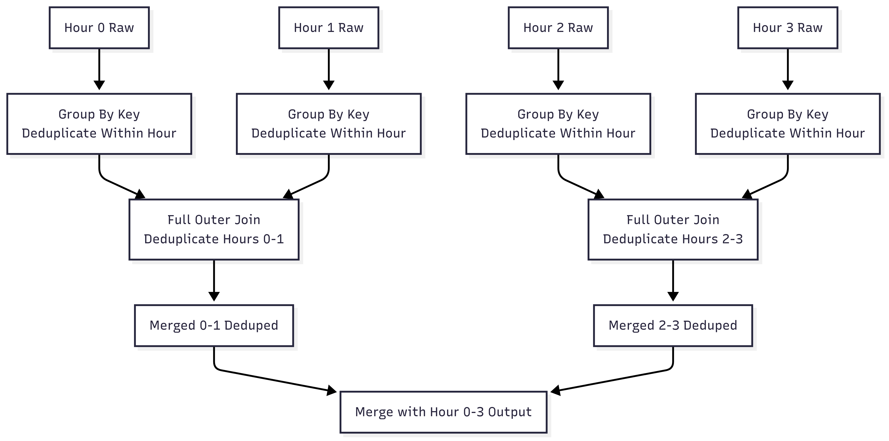

#### Fact Data Modelling

<details>
<summary> What is a Fact?</summary>

- Fact is measurable event or value = business data 
- Biggest data you will work with 
- Something that has happened
    - A user logs in to an app 
    - A transaction is made 
    - You run a mile with your fitbit
- They are atomic - each record is at the lowest level of detail you want to store.
- They can't change(once a transaction is recorded, it stays as-is to preserve history) whereas dimensions have slowing changing pattern.
- Often linked with a dimension (product, time or location)


#### Why they are hard?
- Fact data is usually 10-100x the volume of dimension data 
    - For example, 2Billion user at FB -> 25-30 notifications a day = 2b * 25 notifications/day = 50 B notifications/day 
- Facts alone are not very meaningful without context
    - When you record a fact like “notification sent,” it’s just a single event. To make sense of it, you need to connect it to other events (like clicks and purchases) and to dimensions (like country, user, time, device, etc.). This is what enables powerful analyses, such as:
        - Funnel Analysis: By linking facts ( FB notification -> clicked -> bought something (purchase)), you can see how users move through each stage and where they drop off.
        - Dimensional Analysis: By adding dimensions (like country), you can compare performance across different segments, such as “users in Canada have a higher click-through rate than users in the US.”
- Duplicates in fact tables are much more common than in dimension tables 
    - Notification 1 -> click on it at 1pm and then at 7pm 
    - If your analysis is about unique clicks per notification, you wouldn’t want to count both clicks as separate conversions for that notification - dedup is required
    - Dimension tables, on the other hand, store descriptive information (like product names, user profiles, or country codes). Each dimension record should be unique—there should only be one row per product, user, or country.

#### Trade-offs between Normalized and Denormalized fact tables
- Normalizes facts don't have any dimensional atributes, just IDs to join to get that info
    - `userid, login_time, and maybe event_id,` but not the user’s age, gender, or location
    - you want to maximize data integrity and minimize storage by not including all dimensions
- Denormalised facts bring in some dimenstional attrbutes for quicker analysis at the cost of more storage 
    - For your analysis, you stored `userid -29 year old - male who lives in CA` - logged in at this time so you don't have to bring in all dimensions again 
    - faster because no need of doing joins 
    - but if fact data is huge then you are storing this redundant info multiple times
- Key Thing to remember - “The smaller the scale, better to use normalization”. As data grows, sometimes denormalization is necessary for performance, but it comes with trade-offs.

#### Fact data and raw logs 
- Raw Log data 
    - Ownership - Software engineers
    - Ugly schemas designed for online systems that makes data analysis sad
    - Logs may contain duplicates, missing values, or other data quality issues.
    - Retention is usually short-term, just enough for troubleshooting or recent analysis, since the volume is high and the data is noisy.
- Fact Data (more trust)
    - DE owned
    - Schemas are cleaned up, with clear and meaningful column names, making them much easier to use for analytics.
    - Quality Guarantees like uniqueness, not null etc
    - Fact tables are trusted sources for reporting and analysis, so they’re kept for longer periods.

#### How to model Fact Table
- Who -> represented by IDs like user_id, account_id, etc.
- Where -> location/country/ where on the app (profile page?) - IDs 
- How and Where are every similar (how = on the iphone, where on the page ) Describes the method or platform
- What -> atomic
    - The atomic event or action being measured (e.g., notification generated, sent, delivered, clicked)
    - should be not null 
- When -> timestamp or date -> critical for facts 
    - UTC timezone - all devices using same timezone 
    - client side logging in UTC not on timezone of client 
    - should be not null 

- No duplicates in fact data: Each fact should represent a unique event or transaction.
- Fact tables should be smaller than raw logs: Because they’re cleaned, deduplicated, and only contain the most relevant information for analysis.

#### When should we bring in the dimentions : Denormalize at Scale
- **The Problem**: Network Logs at Scale
- **Context**:
    - Netflix's microservices architecture generated 2 petabytes/day of network request logs - Over 100TBs/hr
    - Each log entry recorded source/destination IP addresses for microservice communication.
- **Goal**: Analyze service dependencies for security (e.g., "If Service A is hacked, which services does it talk to?").
- **Initial Approach**: Broadcast Joins
    - Joined IP logs with a small IP-to-service mapping table (5–6 GB) using Spark's broadcast join.
    - Why it worked: The mapping table fit in memory, enabling efficient joins.
    - Limitation: Only supported IPv4 addresses.
    - IPv6 Adoption Broke Everything: IPv6 exploded the mapping table size (> broadcast join limit).
    - Shuffle joins increased costs 10x and made the pipeline unsustainable.

- **The Solution: Sidecar Proxy**
    - Architecture Shift:
        Instead of joining logs post-hoc, Netflix denormalized data at the source.
        Deployed a sidecar proxy alongside each microservice to inject app metadata into logs:
        Before: Logs only had raw IPs.
        After: Logs included source_app and destination_app names.
    - How the Sidecar Worked:
        Intercepted network traffic between microservices.
        Enriched logs with service identities before they reached storage.
        Lightweight: Ran as a separate container/pod alongside each microservice.
- **Key Lessons**
    1. Denormalize at Scale:
        - When dimensions grow too large for joins (>5–6 GB), denormalization wins.
        - Tradeoff: Increased log storage vs. eliminated compute costs.
    2. Solve Upstream:
        - The optimal solution often isn’t a bigger pipeline—it’s fixing data at the source.
        - Collaboration with app teams > brute-force engineering.
        - Fact data was denormalized and logged it ahead of time - talk to 3000 owners
    3. Cost of Ownership:
        - 3000 conversations with developers were harder than building pipelines but had higher ROI.
        - Technical debt in raw data cascades to analytics (e.g., IPv6 tech debt broke pipelines).

- When to Use This Pattern - Consider a sidecar-like solution if:
    1. Joins dominate pipeline costs (especially with growing dimensions).
    2. Raw data lacks critical context (e.g., IPs without service names).
    3. You can influence upstream logging (via proxies, SDKs, or team agreements).
    4. This pattern is now foundational at companies like Netflix, Meta, and Airbnb for handling petabyte-scale event data.

#### Middle layer requirement in the Netflix microservices case
The Data Gap:
    Raw Logs: Contained only low-level network data (source/destination IPs).
    Analytics Need: Required high-level service names (e.g., billing_service → auth_service).
    Missing Link: No direct way to map IPs → service names within the log pipeline.
Scale Broke Traditional Solutions:
    Broadcast Joins: Failed when the IP-service mapping table outgrew Spark's broadcast limit (>6 GB).
    Shuffle Joins: Became prohibitively expensive (10x cost increase) with 2 PB/day of logs.

The Sidecar Proxy as Middle Layer
1. Interception:
    Deployed as a lightweight container alongside each microservice.
    Monitored all inbound/outbound network traffic.
2. Enrichment:
    Looked up service names via a local cache (e.g., Consul, Kubernetes service registry).
    Appended metadata to logs:
```json 
// BEFORE (raw log)
{"src_ip": "192.0.2.1", "dest_ip": "203.0.113.2"}

// AFTER (enriched by sidecar)
{
  "src_ip": "192.0.2.1",
  "src_app": "billing_service", // ← Added by sidecar
  "dest_dip": "203.0.113.2",
  "dest_app": "auth_service"    // ← Added by sidecar
}
```
3. Forwarding: Sent enriched logs directly to storage (e.g., S3, HDFS).

Tradeoff: Added operational complexity (deploying/maintaining sidecars) vs. orders-of-magnitude savings in analytics cost and latency. At Netflix, this was non-negotiable at petabyte scale.

### Key Requirements Driving the Middle Layer
Decoupling:
    Microservices shouldn’t need to know about analytics requirements.
    Sidecars abstracted analytics-specific logic from business logic.
Zero-Downtime Adoption:
    Sidecars could be rolled out incrementally without redeploying services.
Cost Control:
    Avoided massive join operations in Spark.
    Traded slight storage increase for massive compute savings.
Real-Time Context:
    App names had to reflect runtime state (e.g., during auto-scaling, IPs change frequently).

### Deduplication of Fact Data: 
High-volume event data (e.g., user clicks, notifications) often contains duplicates due to retries, network issues, or logging errors. Here's how Meta/Facebook and Netflix tackled this:

###### Why Deduplicate?  
- **Problem**: Duplicate records skew metrics (e.g., 200% click-through rates) and waste resources  
- **Common Causes**:  
  - Logging bugs (double-emitting events)  
  - Genuine user actions (e.g., clicking notifications multiple times)  
  - Network retries/redeliveries

**Facebook's Notification Deduplication***  
- **The Challenge - 50 billion notifications/day**  
    - Duplicates could occur hours/days apart (e.g., notification clicked today + next week)  
    - Initial Hive pipeline: **9 hours to deduplicate**, blocking downstream processes
- **Solution: Hourly Microbatch Deduplication**


```sql 
-- 1. Intra-Hour Deduplication:
WITH deduped_hour AS (
  SELECT *,
         ROW_NUMBER() OVER (PARTITION BY notification_id, user_id 
                            ORDER BY event_time) AS rn
  FROM raw_notifications
  WHERE hour = '2023-01-01-00'
)
SELECT * FROM deduped_hour WHERE rn = 1

-- Cross-Hour Deduplication:
-- Full outer joins between deduped hourly outputs in a tree pattern

```
- **Results:**
    - Latency reduced from 9 hours → 1 hour
    - Handled duplicates across arbitrary time windows

#### When streaming fails 
- Why Facebook Rejected Streaming
    1. Required holding all notification keys in memory for 24+ hours
    2. Impossible at 50B events/day → memory explosion
- Where Streaming Works
    1. For duplicates in short windows (<30 mins):
    ```python
    # Pseudo-code for Spark Streaming
    (events
    .withWatermark("event_time", "30 minutes")
    .dropDuplicates(["event_id", "user_id"])
    ```
    2. Use cases: Ad clicks, cart additions (95% dupes within minutes)

Tip : "Deduplicate as early as possible—solving it upstream (e.g., with UUIDs) is cheaper than battling petabytes downstream."
</details>

<details>
<summary>  Lab NBA Game Details Deduplication </summary>

1. **Dataset**: `game_details_raw` table with duplicates  
**Goal**: Create clean `game_details` fact table

2. Deduplication Strategy
    - Key: (game_id, team_id, player_id) uniquely identifies a player's performance per game.
    - Rule: Keep the record with highest minutes played (min column) when duplicates exist.
</details>

<details>
<summary> Blurry line between Fact vs Dimension </summary>

1. Facts vs. Dimensions
    - Facts: 
        - Numeric, additive metrics (e.g., user actions like clicks, likes) stored in fact tables. They are high-volume and tied to events.
        - they go inside the aggregated function 
        - high cardinality (one user can do multiple things, and multiple times)
        - comes from logs, when an event happens 
        - change data capture 
            - because you kind of model a state change of a dimension as an event or as a fact and then you can kind of recreate your dimensions at any moment in time based on the stack of changes that have happened.
            - The state change is the fact; the resulting state is the dimension.
    - Dimensions: 
        - Descriptive attributes (e.g., user status, device type) used for grouping/filtering. Often sourced from snapshots of state.
        - come in Group By 
        - come in from a snapshot on a date 
    - Blurred Line:
        Dimensions can be derived from aggregated facts (e.g., `dim_is_active` based on `event counts`). If you click on something.
        Pure dimensions come from state changes not activity driven (e.g., `dim_is_activated` from account deactivation flags).
        Event - you mutated your status so that is a fact the action but status is dim.
        Example: price of a listing at Airbnb is a dimension (state-derived) despite seeming fact-like (summable)
2. Bucketization :
    - Purpose: Reduce high cardinality in dimensions derived from facts (e.g., grouping "number of likes" into ranges like 0–5, 6–10).
    - Best Practices:
        - Use statistical distributions (e.g., percentiles) instead of arbitrary ranges. Box and whiskers 
        - Avoid single-element buckets to ensure meaningful groupings.
        - Balance flexibility and compression (5–10 buckets ideal).
    - Business Impact: Bucket definitions are hard to change (e.g., Facebook's 5,000-friend limit), these have impact long term - get people involved 
    - Linkedin 30K limit 
    - can be based on multiple columns - Airbnb superhost 
    - dim_is_available - did a host set a rule that you cannot book 
                       - can a trip be booked  
                       - long time 2 years 
- Active users vs activated users 
    - sign up vs growth 
</details>


<details>
<summary>   Date List Data Structure</summary>

- Calculate Monthly Active user 
    - everyday calc last 30 days of facts 
    - to find out, only one thing changed, you don't want to process this much data 
- Facebook uses a users_cumulated table storing:
    * user_id
    * dates_active[] (array of active dates, where user was active)
    * date (current snapshot date)
- **Datelist_int** - Converts date arrays into 32-bit integers where:
    Each bit represents a day (1 = active, 0 = inactive)
    LSB = most recent day, MSB = oldest day (30-day window)
    Example: 1101 (binary) = active 3 of last 4 days
</details>

<details>
<summary> Understanding Shuffle - How to minimize Shuffle  </summary>

- Some steps will have more parallism than others in your big data pipelines - shuffle reduce it 
- When you’ve got a pipeline that requires shuffling, it limits how parallel your operations can be because data often needs to be consolidated onto specific machines
- Essentially, less shuffle means faster processing and cheaper jobs, which is a big win when dealing with high-volume data.

### Keywords Impact
1. Select, From, Where **(without window functions)**: 
    - These are infinitely scalable. 
    - You don’t need to shuffle data because each machine can process its own - chunk independently. It’s like each machine just checks its data against a condition and moves on—no need to talk to other machines. 
    - Super fast, super cheap.
2. Group By, Join, Having (kinda parallel): 
    - These cause shuffle because they require **data for a specific key to be on the same machine.** For example, with Group By, if you’ve got data for one user spread across multiple machines, all that data needs to be moved to a single machine to aggregate it properly.
    - All rows need to be on one machine and if my 30 rows are on 30 machines then move all that into one machine - Triggers Shuffle
    - Join is even trickier since it shuffles data from both sides of the join. Keys on left and keys on right need to be pushed to a partition and the match the keys. 
    - Having is tied to Group By, so it’s post-shuffle but acts like a filter. 
    - These operations typically default to 200 shuffle partitions in Spark (configurable via `spark.sql.shuffle.partitions`), which means data gets funneled into fewer machines for processing. So if there are billion machines they will all send it to 200 partition machines.
3. Order By **(at query end)**: 
    - This is the least parallelizable and most painful. 
    - A global sort requires all data to be on one machine, which is the opposite of parallel processing. 
    - It’s a sequential nightmare if you’re dealing with millions of records.
    - use after aggregation has happened and data is not in billions, it is reduced.  
    - However, using Order By within a window function with a Partition By clause reduces the shuffle to the partition level (similar to Group By), which is more manageable.

**The key takeaway here is that how your data is structured determines which of these keywords you need to use.**


#### Strategies to Minimize Shuffle

1. Bucketing Data: 
    - By bucketing (e.g., into 8 buckets using modulus grouping), you ensure data for a key is already on the same machine or partition. Pre-shuffling data when you write it out, based on a high-cardinality key like user ID.
    - When you run a Group By later, there’s no need to shuffle because the data is already organized. This is a powerful tactic in systems like Spark, S3, Iceberg, Hudi, or Delta Lake, and it’ll be covered more in Week 5.

2. Reducing Data Volume (Reduced Facts): 
    - By aggregating data into smaller, more compact forms, you drastically cut down the amount of data that needs to be shuffled. Less data means less movement across machines, which speeds up queries and reduces costs.
    - This approach involves transforming raw fact data into more efficient schemas.

#### Fact Data Schemas: From Raw to Reduced
1. Raw Fact Data: 
    - most granular level, with a schema like `user ID, timestamp, action, date, and other properties (e.g., device type)`. 
    - high volume but super flexible—you can answer very specific questions - only practical for short time horizons (a few days to a month) because the volume becomes unwieldy for longer periods-Queries over large timeframes slow down or fail due to memory issues.
    - one row per event
2. Daily Aggregates (Metric Repository): 
    - This aggregates raw facts into daily summaries, with a schema like `user ID, metric name (e.g., likes given), date, and count. `
    - It reduces volume significantly (e.g., 100x smaller) by collapsing multiple actions into one row per user per metric per day. 
    - This schema works well for longer time horizons (1-2 years), supports joins with slowly changing dimensions (SCDs) at daily granularity, and is used in experimentation frameworks like Deltoid at Facebook for A/B testing. However, queries over years can still take days, which is painful for quick analysis.
    - one row per user/day
3. Reduced Facts: 
    - This is the most compact form, with a schema like `user ID, metric name, month start date, and an array of values` (e.g., daily counts for a month). 
    - Instead of storing dates explicitly, the position in the array represents the day (e.g., index 0 is July 1st, index 30 is July 31st). 
    - similar to date list - doing for non binary things but for actual values
    - This cuts volume by another 30x (for monthly) or 365x (for yearly) compared to daily aggregates. 
    - one row per user/month or /year 
    - you loose some flexibility on what kind of analytics you can do on top of it so it a trade off between speed and flex

#### Impact of Reduced Facts at Facebook
- Implemented reduced facts at Facebook during a historic decline in growth.
- This schema unlocked long-term, slow-burn analyses that traditional daily aggregates couldn’t handle efficiently. 
- By loading 50 core metrics and 15 core dimensions into this format, they enabled 10-year analyses to complete in hours, facilitating root cause analyses (RCAs) to identify subtle trends and user behavior shifts over time.
- Allowed for fast correlation between user-level metrics and dimensions 
- 10 year backfill - will take a week- it took them 3-4 hours 
</details>