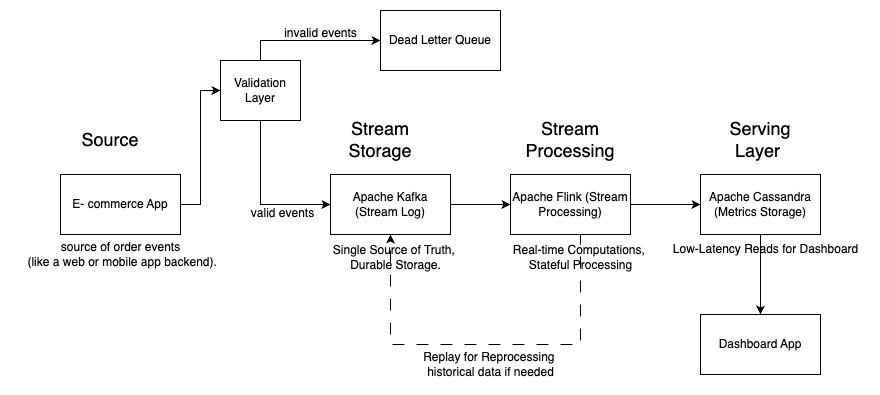

 API - is like a contract that defines how different software components can interact

- [Why data architecture depends on API](https://www.linkedin.com/pulse/what-api-why-data-architecture-depends-them-alex-merced-25zce/?trackingId=PklAx0ODRUmM1tcQCGEhrw%3D%3D)

 Lambda architecture 

- Lambda has three layers
    1. batch for historical data
    2. speed for real-time
    3. and serving for queries.
- Pain to maintain because you’ve got two processing paths that might produce slightly different results due to code or logic discrepancies.

 Kappa architecture 

- Response to the complexity of the Lambda Architecture, which separates batch and stream processing into two distinct layers.
- Kappa basically says, “Why have two systems when you can do everything with streams?” It’s a unified approach where all data—whether it’s historical or real-time—is treated as a stream, and you process it using a single streaming engine.
- Implemented at LinkedIn, Uber, and Netflix

#### Basic Idea
- You’ve got a stream of data coming in, like logs, events, or sensor readings, and this stream is stored in a durable, append-only log (think Apache Kafka). This log acts as the single source of truth.
    - Highlight that this log retains data for a long time (or indefinitely), so you can replay it if needed for recalculating results or debugging.
    - Mention this avoids the need for a separate batch system, reducing operational complexity.
- From there, you use a stream processing engine (like Apache Flink or Kafka Streams) to process the data in real-time, generating results or views that can be queried.
- If you need to reprocess historical data or fix something, you just replay the stream from the log. No separate batch system needed.

1. Data source feeding into a stream storage system
2. stream processing framework to handle the computations
3. downstream systems or databases where the processed results are stored for querying or analysis

#### When to Use ?
- Given the need for `real-time updates` and the `ability to handle historical data` without a `separate batch system`, I’d propose a Kappa Architecture. It simplifies the pipeline by `treating all data as streams`, which `reduces maintenance overhead`.
- System handling real-time data like `user clicks`, `IoT sensor data`, or `financial transactions`? If the focus is on low-latency insights or continuous updates

#### Challenges 
1. What if reprocessing takes too long?
    - partitioning the stream effectively or using stateful processing with checkpoints to avoid full replays.
2. If the system requires complex batch computations that aren’t easily expressed as stream processing (like some machine learning model training), you might need to hybridize with batch tools or admit Lambda could be better.
3. Also, replaying large streams for historical reprocessing can be slow if the data volume is massive, so you’d optimize by checkpointing or using compacted logs.

#### Scalability and Fault Tolerance 
- Stream processing systems like Flink or Spark Streaming can scale horizontally by adding more nodes. Also, since the log (e.g., Kafka) is replicated, your system is fault-tolerant—if a processor crashes, you can restart and replay the stream without losing data.

#### Use cases 
1. Real-time fraud detection in banking
2. 

#### Example 

Design a real-time e-commerce order analytics system.

The goal is to process incoming orders, compute metrics like total sales and average order value in real-time, and store results for a dashboard to display.

#### Stage 1: Data Ingestion
In an e-commerce, order events (like “order placed” with details such as order ID, timestamp, customer ID, and total amount) are generated by the application or microservices.
These events are sent to a durable, append-only log system. 

1. Tool Choice: Apache Kafka for stream storage. Kafka acts as the single source of truth, storing all order events in a topic called, say, “order-events.” Each event is a JSON or Avro message with the order details.
    - Why Kafka?: It’s distributed, fault-tolerant with replication, and can retain data for a long time (or indefinitely with proper configuration), allowing us to replay streams if needed.

2. Process: The e-commerce app publishes events to Kafka via a producer API as soon as an order is confirmed. Kafka partitions the data across multiple brokers for scalability, ensuring we can handle high throughput during peak shopping times.

#### Stage 2: Data Transformation
Now that we have the raw stream in Kafka, we need to process it to extract meaningful insights. This is where stream processing comes in, it handles both real-time and historical data in the same way.

1. Tool Choice: Apache Flink for stream processing. Flink is great for low-latency, stateful computations on unbounded streams.

2. Processing Logic: We’ll set up a Flink job that subscribes to the “order-events” topic in Kafka. 
    - The job will perform transformations to compute metrics. For example, it can maintain a running sum of order totals for “total sales” and a count of orders to calculate “average order value” using time windows (e.g., last 5 minutes or last hour).

3. State Management: Flink keeps track of state (like the running sum and count) in memory or a backend like RocksDB, with periodic checkpoints to Kafka or a distributed filesystem for fault tolerance. 
    - If the job crashes, it can recover from the last checkpoint and continue processing.

4. Reprocessing Capability: If we need to fix a bug in the logic or recompute metrics for historical data, we can replay the stream from Kafka by resetting the consumer offset to an earlier point. This is a key Kappa feature—no separate batch system required.

The transformation stage turns raw events into aggregated insights. For instance, an incoming event like `{order_id: 123, total: 50.0, timestamp: 2025-06-29T10:00:00}` gets processed into an updated metric like `{window: "10:00-10:05", total_sales: 150.0, avg_order_value: 37.5}.`

#### Stage 3: Data Storage and Serving
After processing, we need to store the results somewhere accessible for querying by the dashboard or other applications. Since this is real-time, we want a storage system that supports fast reads and updates.

1. Tool Choice: We’ll use Apache Cassandra as the serving layer. Cassandra is a distributed NoSQL database optimized for high write throughput and low-latency reads, perfect for real-time dashboards.
    - TODO - check other options like Dynamo DB, postgres, Snowflake  

2. Storage Design: The Flink job writes the processed metrics to Cassandra tables. For example, we might have a table called “order_metrics” with columns for time window, total sales, and average order value. Each processed window updates or inserts a row in this table.

3. Access Pattern: The dashboard application queries Cassandra directly via a REST API or similar interface to fetch the latest metrics for display. Since Cassandra is distributed, it can handle concurrent read requests from multiple dashboard instances.

4. Retention: We might configure Cassandra to retain data for a certain period (e.g., last 30 days of metrics) if we don’t need older data for display, though Kafka still holds the raw events indefinitely for reprocessing if needed.

This stage ensures the processed data is readily available for end-user consumption, completing the pipeline from raw events to actionable insights.

#### Addtitional Tips 
1. Scalability: Mention how Kafka partitions and Flink’s distributed processing allow horizontal scaling. For high order volumes, you add more Kafka brokers or Flink task managers. Cassandra also scales by adding nodes for more read/write capacity.

2. Fault Tolerance: Highlight Kafka’s replication and Flink’s checkpointing. If a node fails, data isn’t lost, and processing can resume from the last checkpoint.

3. Latency: Note that this design prioritizes low latency since everything is stream-based. Typical end-to-end latency from event to dashboard update could be under a second with proper tuning.

4. Trade-offs: Be honest about limitations. Replaying a massive historical stream in Kafka can be slow if data retention is long, so you might use compacted topics or periodic snapshots in Flink to optimize. Also, if complex batch ML training is needed on historical data, you might need a hybrid approach outside pure Kappa.

5. Monitoring: Suggest adding monitoring tools like Prometheus or Grafana to track pipeline health (e.g., Kafka lag, Flink processing delays) to ensure the system runs smoothly.

6. Data Quality: 

