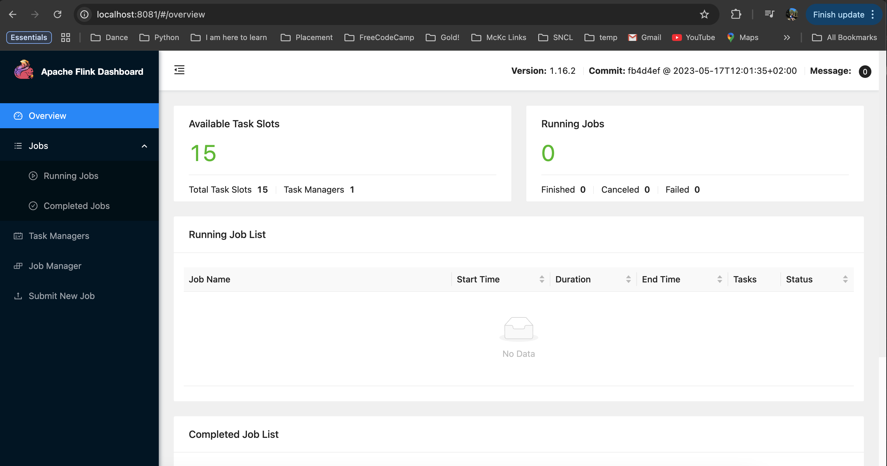
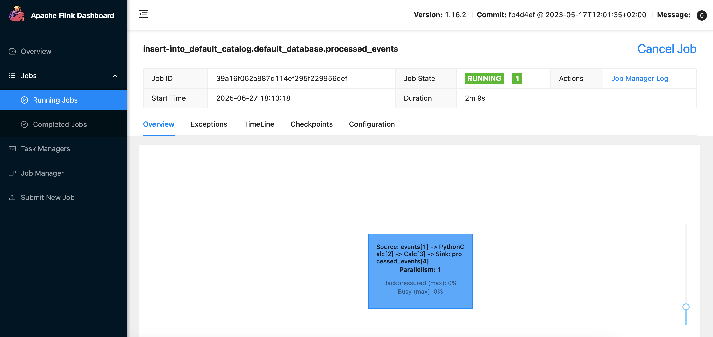
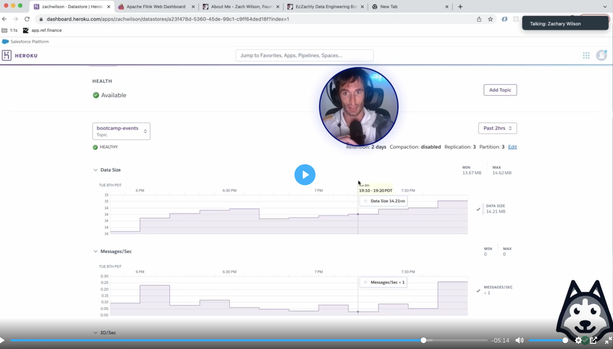
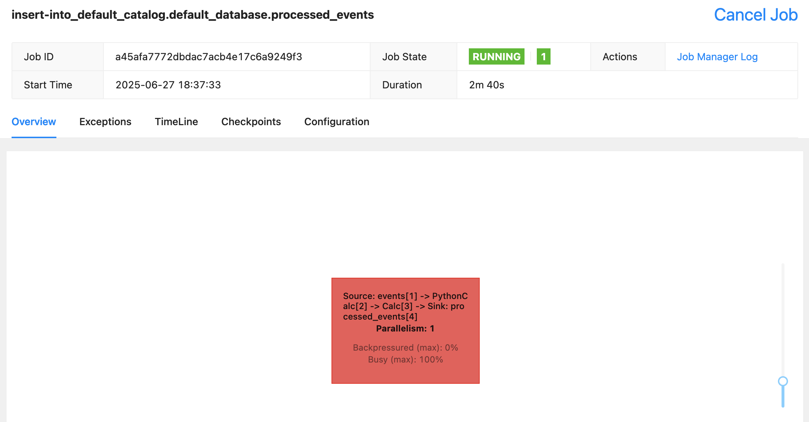
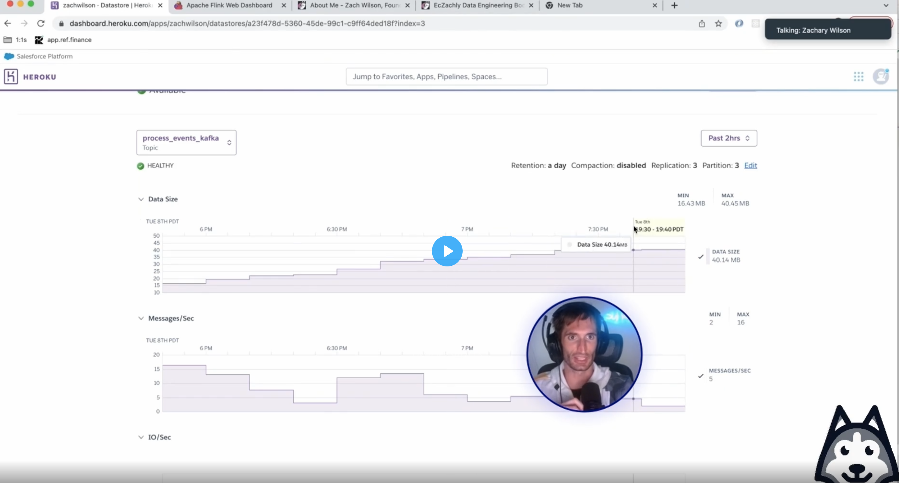

Notes from [DataExpert.io Flink Lab](https://learn.dataexpert.io/lesson/flink-lab-setup-yt)

#### Learning Objectives 
- Writing a job that connects to Kafka
- Filtering out events we don’t care about
- Writing the events to Postgres

 Notes  

1. Flink Dashboard 

2. Running Job 
    
    One job running because of postgress sink load function, `backpressure` 0 , `busy` 0  -> all good.

3. Job Submission 
    Earliest offset will process all the data from the begining, all 15 MB from last day.
    
    Now the job gets very busy because we changes the offset to earliest offset.
    - Busy = we are at max compute, cannot process more data
    - Backpressure = tells kafka to slow down, so we can process all the data
    - Kafka Sinks are very high throughput sink
    - Postgress sinks are slower - need to consider this
    

4. Kafka Dashboard View 
    

 Aggregates in Flink 

    
- You can't window without a watermark in Flink
- no purple is good else you need to increase parallelism or tasks available 
- wait till 5min - tumbling window - didn't understand properly 
- grouping on window and host 
- earliest offset and latest offset makes a lot of difference - specially in aggregations - ToDo: go deep in this 
- do we need to do this aggregation in real time ? 
- change `env.set_parallelism(3)` in aggregation_job.py, play with number of tasks and check how it is changing the jobs 
- number of tasks and parallelism on each task is different `6-6` square on Flink UI means two stages each with 3 parallel on each subtask of the task - speed of reading will improve check in task details, number of records, also change to read earliest to get the volume  
- Spark default is 200 , flink is 1 
- when no spike we don't want these many tasks 
- where should you run these aggregation, flink(5 min aggregation)?, spark(even to start it will take 5 min)? if you are grouping or deduping for over an hour then do batch(spark)
- you do tumble aggregation for 30 min not for an hour, then you do aggregation in spark for an hour or 5 hour. 
- At small scale, Flink can do daily aggregation, and have all the data and then write it down , it persists to disk after 5 min , that is why batch is better for longer windows cause flink will need lot of memeory to store it. 

