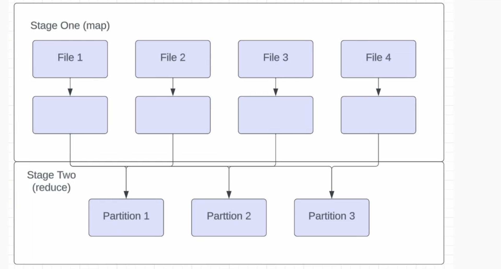

## Spark 

- Started with Hadoop(Java Map/Reduce) in 2009 -> Hive (switch from Hive to Presto) Presto does everything in memory, if it is not happening in memory it fails -> Spark 
- APIs of Spark - Dataframe, SparkSQL, Dataset, Pyspark

#### Features 
- Leverages RAM 
Group by in Hive - written and read from disk - very resilient but slow 
- Spark - minimize time by
- Spark only write to disk when not enough mem the only it spill to disk 
- Storage Agnostic - you can read anything you want Mongo DB, Relational DB 
- Don't necessarily need to use with databrick 

#### Don't wanna use spark when
- you are the only one who knows spark - better reliance and maintainability and distribute work - Use big quey or snowflake - Homogeneity of pipelines is imp

#### Components 

1. Plan   (Play)
- Transformation you do in Python, SQL, Scala
- Plan is evaluated lazily (execution only happens when it needs to )
- write data out somewhere or collecting data (taking info from play and bringing to coach and coach telling what to do next)

2. Driver (Coach)
- driver reads the plan what plan to run 
- can have multiple setting (may be 10), 2 you need to know
- mem driver has to process the job `spark.driver.memory` can go all the way to 16GB, default to 2 GB 
    - Two cases when you need to bump it 
        - collect() when data it is processing changes the plan of the job, bad practice
        - complicated job where it has multiple 
- memory overhead `spark.driver.memoryOverheadFactor`
    - complicated job then - mem that java needs to run- JVM take up more memory
    - What % of mem driver needs for non heap related tasks, usually 10%

    Driver Tasks 
    1. When the job should Execute - when it finds output or collect() 
    2. How to JOIN the datasets - what type of join - determines the performance of your job 
    3. How much Parallelism is needed in each step 
        - let's say you are dealing with two big datasets 
        - how many files those datasets are written to 
        

3. Executor (Players)
- Actually do the work - Driver passes the plan to Executors, they transform - aggregate 
- Settings 
    1. `spark.executor.memory` - same constraint as driver mem 2-16GB 
        - Determines how much memory each executor gets 
        - If a job OOMs people will update it to 16GB and then leave , run it at different level, and one of them runs all the time for couple of times. 
        - You dont want too much padding - expensive 
    2. `spark.executor.cores` 
        - How many task can happen on each machine 4-6 - more parallelism 
        - Bottleneck - throughput of too many task running at the same time
        - Skewed tasks 
    3. `spark.executor.memoryOverheadFactor` 
        - What % of mem should executor use for non heap related tasks usually 10%. For jobs with lots of UDFs you might need to bump this.
        - can increase this without increasing memory


<details>
<summary> Types of JOIN in Spark</summary>
 
1. Shuffle Sort Merge Join 
    - Default Join 
    - Works when both sides of join are large datasets 
    - most versatile , least performant
2. Broadcast Hash Join 
    - works well if one side of join is small, it just ships the whole dataset to the executor and you don't have to shuffle at all, upto 8-10 GB you will be okay.
    - `spark.sql.autoBroadcastJoinThreshold` default is 10 Mb, problems above 10 GB
    - A join without Shuffle!
3. Bucket Join
    - A join without Shuffle!

Use .explain
Add Diagrams 
</details>


<details>
<summary>  How does Shuffle work? </summary>

- Shuffling in Spark is the process of redistributing data across the partitions of a cluster so that `related data (usually based on a key)` ends up on the `same executor or node` for processing.
- Spark works on a divide-and-conquer model, splitting data into partitions that are processed in parallel. When an operation requires data from different partitions to be combined—like in a join or aggregation—Spark needs to move data around to group it appropriately.
- When a shuffle is triggered, Spark first determines `how to partition the data based on the operation`. For most operations like joins or groupByKey, it uses a `hash-based partitioning strategy`. This means Spark applies a hash function to the key (or keys) of each record to decide which partition the record should go to. The goal is to ensure that records with the same key land in the same partition, so they can be processed together.
- For example, in a join, if two rows from different datasets have the same join key, the hash function ensures they’re sent to the same target partition.
- Two main phases: 1. write phase 2. fetch phase.
    - `WRITE Phase` - each executor processes its local partitions of the data, computes the hash of the keys, and writes the data into temporary files (or buffers) on its local disk, grouped by the target partition,—but the data stays on the original executor. These are often called "shuffle files." 
    - Spark also creates a map of where each piece of data is written, so it knows which executor holds which partition’s data. This step can spill to disk if the data doesn’t fit in memory, which is common with large datasets.
    - `FETCH Phase`, executors pull the data they need for their assigned partitions from other executors across the cluster. This is where the network overhead comes in, as data is transferred over the network between nodes. Each executor reads the shuffle files (or buffers) from other executors based on the partition mapping created earlier. Once the data is fetched, it’s ready for the next stage of processing, like sorting or merging in the case of a Shuffle Sort Merge Join.
    - Writing locally first allows executors to process and bucket the data without immediate network transfer, which can be done in parallel and reduces contention. It also means that if something fails, Spark can recover using lineage information without having to redo the entire shuffle from scratch. The fetch phase then focuses on moving only the necessary data to the right place for the downstream computation, like a join or aggregation.
    - `Shuffling is expensive` because it involves **disk I/O**, **network transfer**, and sometimes **serialization/deserialization of data**. It’s often a bottleneck in Spark jobs, especially if the data is unevenly distributed (data skew), causing some partitions to be much larger than others, or if the cluster’s network bandwidth is limited. Spark tries to optimize this with techniques like combining records before shuffling (using combiners in operations like reduceByKey) to reduce the amount of data moved, or by tuning parameters like the number of partitions to balance the load.
    - `Shuffling happens automatically when needed, based on the operation.` You don’t explicitly trigger it, but you can influence it by setting configurations like `spark.sql.shuffle.partitions` (default is 200) to control how many partitions the shuffled data is split into, which can help manage workload distribution.



- Least Scalable part of Spark, as scale goes up 20-30 TB a day, shuffle is out of window, you need to solve differently
- Let's say you have a Table with 4 files - we do a map operation first (add a new column, or .withcolumn()) - map is infinitely scalable - then imagine we do a group by user id - Let's say we have 3 partitions, (default is 200) so you divide user_id by 3 then whatever remainder you get is the partition number where it goes. 
- So all data from File4 will be in partition 1,2 or 3.
- In join also, shuffle will be similar, and then you can do the join. 


- `spark.sql.shuffle.partitions`  and `spark.default.parallelism` are essentially the same unless you are using RDD API
- Is shuffle good or bad ?
    - Low to Medium Volume  - Good
    - High Volumn > 10 TB - Painful
    - network calls - which IP was connecting to which IP microservice?
    - IPV4 to IPV6  movement shuffle couldn't work 

When to bucket ?
- to minimize or eliminate the need for shuffle in join 
- When multiple joins happening downstream 
- Shuffle cost to bucket 
- If you are doing one join then why you doing that ? Only benefit when there are multiple joins 
- Presto can be weird with bucketted tables 
- main drawback - initial parallelism = # of buckets 
- Bucket join only works when two tables have multiple of each other buckets if one has 2 other has 3 it will not work

- Notification 10TB join Notification 50TB 
- bucketted the tables on user_id 1024 buckets 
- join without shuffle 
- files have guarantee - all data for that id is in that file 
- user_id % bucket_id 
- line up the buckets 
- even if two tables don't have same number of buckets,  they are multiple of each other - Always bucket in power of 2
- How to bucket? We had 10 TB of data - 1024 - 10GB per bucket - you don;t want empty buckets as well

- Bucketting 100 TB per hours at Netflix 
- Solved upstream - asked teams to log app in the data - removed the join altogether.


</details>


<details>
<summary> Shuffle and Skew </summary>

- When one executor has drmatically more data
- Jobs will get to 99%, taking forever then fail 
- box and whiskers plot and do the DS way, to test if your data is skewed


### Ways to deal with Skew
- Adaptive Query Execution - Only in Spark3 
    - set `spark.sql.adaptive.enabled` = True 
    - more expensive - slower
- Salting the group by - Before Spark 3
    - Group by a random number, aggregate + Group by 
    - Careful with AVG - USE sum, count and divide
- Joins 
    - identify the outliers and filter them out 
    - partition the downstream table - one side handle the outlier and otherside handle the other 


#### Spark on Databricks vs regular Spark
- Notebook on Databricks - good for PoCs - good for non technical people
- Check code into git - spark submit 

#### Spark Query Plans 
- explain() your dataframes

#### Where can spark read data from?
- Everywhere!
- From the Lake
    - Delta Lake, Apache Iceberg, Hive Metastore
- From an RDBMS
    - postgres, Oracle etc
- REST API 
    - Remember that call is always in the driver, what if reponses are big? Careful on how you are processing that data? 
    Solution - List of urls - call spark.parallelise make the calls in executor, its a tradeoff - you can overwelhm the API with parallel calls. How are people doing it ?
- From Flat Files - csv, json

#### Partitioning 
- on Date - execution date of pipeline 
- ds_partitioning 
</details>


<details>
<summary> Pyspark Lab </summary>

pyspark wraps spark library in python so you can use python 
but built on Java so you don;t see camelcase not get_or_create but getOrCreate


blackslashes 

stage when it is collect()

```python

## Cross Join 
# bad practice filter it out before collect()
df.join(df, lit(1)== lit(1)).collect() 
# java HeapSpace problem 

df.join(df, lit(1)== lit(1)).take(5) 
df.join(df, lit(1)== lit(1)).show(5) 
```

```python 
## At scale they will be very different 

# it will look in the partition and sort locally 
sorted = repartition(10, col("event_date")).sortWithinPartitions()
sorted.explain()

# Global sort of all the data - very slow 
sorted_two = repartition(10, col("event_date"))\
            .sort(col(), col())
sorted_two.explain()
# extra exchange range partitioning line in the plan -- double shuffle 
```

```sql
(

)
using ICEBERG
PARTITIONED by (event_date);


```

- partition by date and there should be partitioning by dates 
- In iceberge after you write your tables out, you can query the metadata of the files, sum(file_size_in_bytes)
- Example of how if you have Low cardinality things togther then you get better partitioning - Run length encoding 
- when sorting data you want lowest cardinality first and then highest cardinality


</details>


<details>
<summary> </summary>

</details>